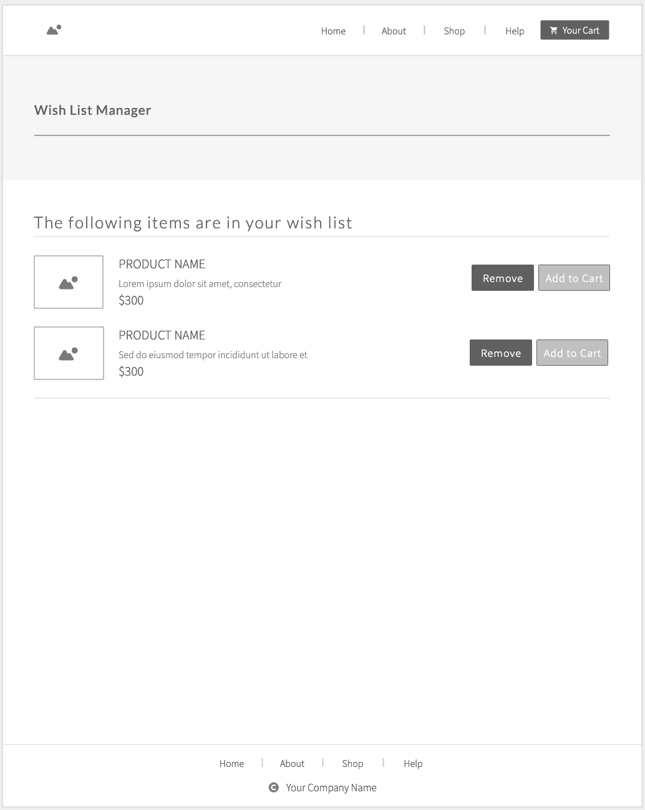
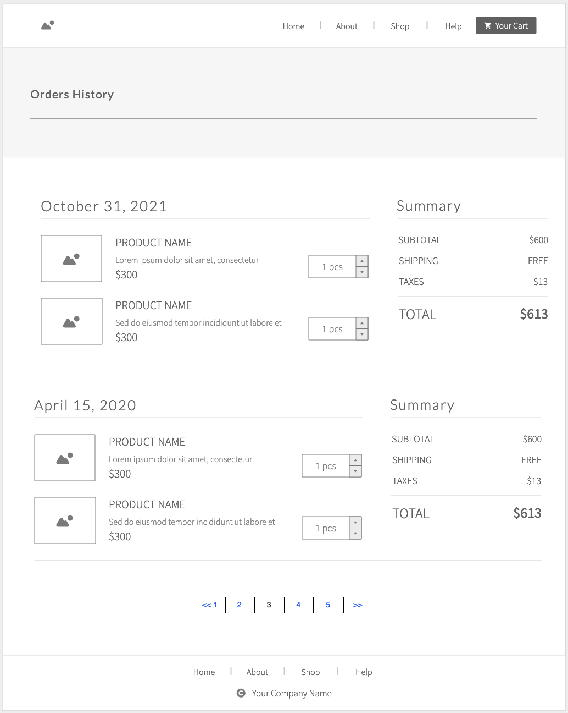

# Data Modeling in MongoDB

## Challenge 2

You will be refactoring the data model for an e-commerce website.

Specifically, we'll be modeling sub-documents, potentially breaking things down into separate collections, and mapping relationships.

As a reminder, here are the 3 pages of the application that we're focusing on:

### Wish List

A wish list where the users can add products that they’re “keeping an eye on” but aren’t in their cart (yet)



## Shopping Cart

Contains the items the user intends to purchase, with a running total price.


### Orders History

Users can browse and view view their previous orders, with the most recent ones showing first.



## Tasks

- Refactor your Customer Collection
- Identify and model any sub-documents
- Identify and model any new collections required
- Identify and create any external references
- Make use of summary fields and eager loading where you can
- Provide your solution in JSON format, with sample data, as shown below

> Example

```json
Car
{
  year: 1986,
  make: “Toyota”,
  model: “Celica”,
  trim: “GT”
  transmission: “Manual”,
  color: “Black”,
  options: [ “Louvers”, “Fuzzy Dice”, “Shag Carpet” ]
}
```
