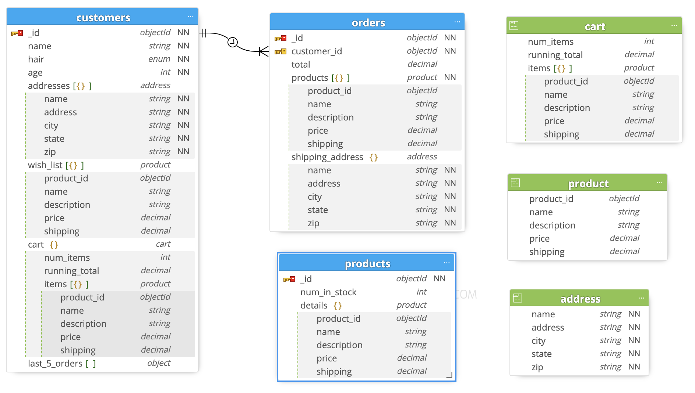

# Data Modeling in MongoDB

## Challenge 3: Solution

Below is one possible solution for modeling the data required for the 3 pages for the e-commerce application

### Entity Relation Diagram (ERD)



### customers.schema

```javascript
db.createCollection('customers',
{
  validator: {
    $jsonSchema: {
      bsonType: 'object',
      title: 'customers',
      required: ['name', 'hair', 'age'
      ],
      properties: {
        name: {
          bsonType: 'string'
        },
        hair: {
          enum: [
            "Black",
            "Blonde",
            "Red",
            "Brown",
            "Grey"
          ]
        },
        age: {
          bsonType: 'int'
        },
        addresses: {
          bsonType: 'array',
          items: {
            title: 'address',
            required: ['name', 'address', 'city', 'state', 'zip'
            ],
            properties: {
              name: {
                bsonType: 'string'
              },
              address: {
                bsonType: 'string'
              },
              city: {
                bsonType: 'string'
              },
              state: {
                bsonType: 'string'
              },
              zip: {
                bsonType: 'string'
              }
            }
          }
        },
        wish_list: {
          bsonType: 'array',
          items: {
            title: 'product',
            properties: {
              product_id: {
                bsonType: 'objectId'
              },
              name: {
                bsonType: 'string'
              },
              description: {
                bsonType: 'string'
              },
              price: {
                bsonType: 'decimal'
              },
              shipping: {
                bsonType: 'decimal'
              }
            }
          }
        },
        cart: {
          bsonType: 'object',
          title: 'cart',
          properties: {
            num_items: {
              bsonType: 'int'
            },
            running_total: {
              bsonType: 'decimal'
            },
            items: {
              bsonType: 'array',
              items: {
                title: 'product',
                properties: {
                  product_id: {
                    bsonType: 'objectId'
                  },
                  name: {
                    bsonType: 'string'
                  },
                  description: {
                    bsonType: 'string'
                  },
                  price: {
                    bsonType: 'decimal'
                  },
                  shipping: {
                    bsonType: 'decimal'
                  }
                }
              }
            }
          }
        },
        last_5_orders: {
          bsonType: 'array',
          items: {
            bsonType: 'object'
          }
        }
      }
    }
  }
});
```

### products.schema

```javascript
db.createCollection('products',
{
  validator: {
    $jsonSchema: {
      bsonType: 'object',
      title: 'products',
      properties: {
        num_in_stock: {
          bsonType: 'int'
        },
        details: {
          bsonType: 'object',
          title: 'product',
          properties: {
            product_id: {
              bsonType: 'objectId'
            },
            name: {
              bsonType: 'string'
            },
            description: {
              bsonType: 'string'
            },
            price: {
              bsonType: 'decimal'
            },
            shipping: {
              bsonType: 'decimal'
            }
          }
        }
      }
    }
  }
});
```

### orders.schema

```javascript
db.createCollection('orders',
{
  validator: {
    $jsonSchema: {
      bsonType: 'object',
      title: 'orders',
      required: ['customer_id', 'products'
      ],
      properties: {
        customer_id: {
          bsonType: 'objectId'
        },
        total: {
          bsonType: 'decimal'
        },
        products: {
          bsonType: 'array',
          items: {
            title: 'product',
            properties: {
              product_id: {
                bsonType: 'objectId'
              },
              name: {
                bsonType: 'string'
              },
              description: {
                bsonType: 'string'
              },
              price: {
                bsonType: 'decimal'
              },
              shipping: {
                bsonType: 'decimal'
              }
            }
          }
        },
        shipping_address: {
          bsonType: 'object',
          title: 'address',
          required: ['name', 'address', 'city', 'state', 'zip'
          ],
          properties: {
            name: {
              bsonType: 'string'
            },
            address: {
              bsonType: 'string'
            },
            city: {
              bsonType: 'string'
            },
            state: {
              bsonType: 'string'
            },
            zip: {
              bsonType: 'string'
            }
          }
        }
      }
    }
  }
});
```

### Mongoose Model

If you are a JavaScript developer and attempted to model this set of collections in Mongoose, here's what your model might look like:

> Note that while Mongoose does a great job with simple relationships, if your references are deeply nested as they are here (`customer.cart.items[0].product`) then you'll need another library to assist with the auto-population process of those joins. Check out [mongoose-deep-populate](https://www.npmjs.com/package/mongoose-deep-populate) to see this in action

```javascript
'use strict';

const mongoose = require('mongoose');

const addressModel = new mongoose.Schema({
  name: { type: String, required: true },
  address: { type: String, required: true },
  city: { type: String, required: true },
  state: { type: String, required: true },
  zip: { type: String, required: true },
});

const productModel = new mongoose.Schema({
  name: { type: String },
  description: { type: String },
  num_in_stock: { type: Number },
  price: { type: Number },
  shipping: { type: Number }
})

const ordersModel = new mongoose.Schema({
  customer: { type: mongoose.Schema.Types.ObjectId, ref: 'customers' },
  items: [{ type: mongoose.Schema.Types.ObjectId, ref: 'products' }]
});

const customerModel = new mongoose.Schema({
  name: { type: String, required: true },
  addresses: [addressModel],
  cart: {
    num_items: { type: Number },
    items: [
      {
        name: { type: String },
        price: { type: Number },
        product: { type: mongoose.Schema.Types.ObjectId, ref: 'products' },
      }
    ]
  },
  wish_list: [productModel],
  last_5_orders: [ordersModel]
});


const Customers = mongoose.model('customers', customerModel);
const Orders = mongoose.model('orders', ordersModel);

module.exports = { Customers, Orders };
```
